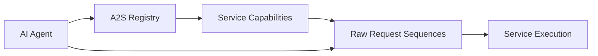

# Agent to Service Protocol (A2S)


A standardized protocol enabling AI agents to discover and execute web service capabilities through raw HTTP requests over secure connections, eliminating the need for parsing documentation or websites.



## Problem

Currently, AI agents struggle to interact with web services because they must:
- Parse complex websites or API documentation
- Handle different authentication methods
- Navigate varying API structures
- Understand multi-step processes
- Keep up with API changes

## Solution

A2S provides a central registry of services with:
1. Standardized capability discovery
2. Pre-configured raw HTTP request sequences
3. Clear variable templates for customization

### Example Service
```yaml
serviceName: "PizzaCo"
serviceDescription: "Online pizza ordering and delivery service"
domain: "api.pizzaco.example"
capabilities:
  - name: "Order Pizza"
    description: "Create a new pizza delivery order"
    executionPath: "/execution/order-pizza"
    requiredScopes: ["order:write"]
  - name: "See Specials"
    description: "List available promotions"
    executionPath: "/execution/specials"
    requiredScopes: ["specials:read"]
```

### Example Execution Path
```yaml
path: "/execution/order-pizza"
description: "Request sequence for ordering a pizza"
requestSequence:
  - id: "auth"
    description: "Authenticate with the service"
    raw: |
      POST /auth HTTP/1.1
      Host: api.pizzaco.example
      Content-Type: application/json

      {
        "clientId": "${CLIENT_ID}",
        "clientSecret": "${CLIENT_SECRET}"
      }
  - id: "place-order"
    description: "Submit the pizza order"
    raw: |
      POST /orders HTTP/1.1
      Host: api.pizzaco.example
      Content-Type: application/json
      Authorization: Bearer ${AUTH_TOKEN}

      {
        "orderItems": [{
          "size": "${SIZE}",
          "toppings": ${TOPPINGS_ARRAY}
        }]
      }
```


## Protocol Specification

### Service Discovery Document

| Field Name         | Type   | Description                                    |
|--------------------|--------|------------------------------------------------|
| serviceName        | string | Name of the service                            |
| serviceDescription | string | Brief description of what the service does     |
| domain            | string | Base domain for all requests in this service   |
| capabilities       | array  | List of capabilities the service provides      |
| metadata           | object | Additional service information                 |

#### Capability Object

| Field Name     | Type            | Description                               |
|----------------|-----------------|-------------------------------------------|
| name           | string          | Name of the capability                    |
| description    | string          | Description of what the capability does   |
| executionPath  | string          | Path to fetch execution sequence          |
| requiredScopes | array[string]   | OAuth scopes needed for this capability   |
| parameters     | array[Parameter]| Optional. List of required parameters     |

### Execution Sequence Document

| Field Name       | Type           | Description                                   |
|------------------|----------------|-----------------------------------------------|
| path             | string         | Path identifier for this execution sequence   |
| description      | string         | Description of what this sequence does        |
| requestSequence  | array[Request] | Ordered list of HTTP requests to execute     |
| variables        | object         | Map of variable names to descriptions         |
| expectedSequence | array[string]  | Required. Order of request IDs to execute     |

#### Request Object

| Field Name  | Type   | Description                                   |
|-------------|--------|-----------------------------------------------|
| id          | string | Unique identifier for this request            |
| description | string | Description of what this request does         |
| raw         | string | Raw HTTP request with variable templates      |

## Security Considerations

The A2S protocol enforces several security requirements to ensure safe communication between agents and services:

- **Transport Security:**
  - All communications must use HTTPS
  - TLS 1.2 or higher is required
  - Valid SSL/TLS certificates from trusted CAs must be used
  - Certificate verification is mandatory

- **Domain Requirements:**
  - All requests in a sequence must be to the same domain specified in the service definition
  - Cross-domain requests are not allowed within a single sequence
  - The Host header in requests must match the service's domain

- **Data Protection:**
  - Sensitive variables (e.g., `${CLIENT_SECRET}`, `${AUTH_TOKEN}`) must be handled securely
  - Tokens should be stored securely and disposed of properly

## Features

- **Registry**: Single source for discovering service capabilities
- **Raw Requests**: Pre-configured HTTP requests ready for execution
- **Variable Templates**: Clear system for request customization
- **Sequence Management**: Handles multi-step processes and dependencies
- **Future-Ready**: Design supports eventual migration to `.well-known` endpoints

## Architecture

1. **Registry Service**
   - Maintains service catalog
   - Provides capability discovery
   - Returns execution sequences

2. **Service Integration**
   - Services register their capabilities
   - Provide request sequences
   - Optional: Future support for `.well-known` endpoints

3. **Agent Integration**
   - Query available services
   - Get execution sequences
   - Execute raw requests

## Development Status

The project is in alpha stage. Core features are being developed:
- Central registry implementation
- Service registration process
- Basic request execution
- Initial documentation

## Future Enhancements

- Proof of concept demo
- Enhanced authentication patterns
- Request sequence validation
- Success/failure pattern matching
- `.well-known` endpoint support for direct service discovery

## Contributing

We welcome contributions! Areas we need help with:
- Protocol specification
- Reference implementations
- Service integrations

Contributions are welcome! Please follow these steps:

1. **Fork the Repository**: Create your own fork to work on.
2. **Commit Changes**: Write clear, concise commit messages.
3. **Open a Pull Request**: Describe the changes and link any relevant issues.

## License

This project is licensed under the MIT License. See the [LICENSE](LICENSE) file for details.