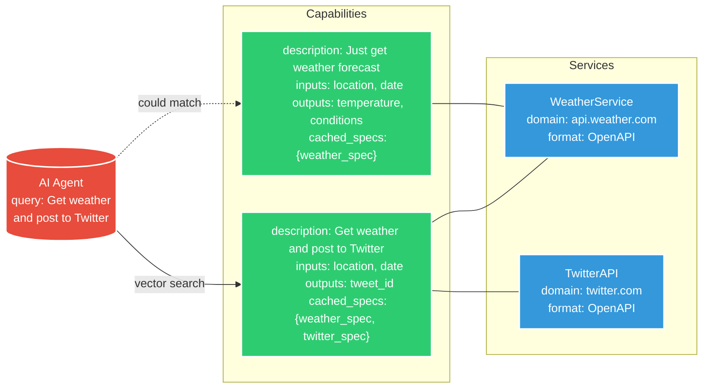

# Agent-to-Service Protocol (A2S)


A2S is a protocol that enables AI agents to discover and interact with web services through standardized capability definitions. It allows for discovery at both the service and capability levels, enabling agents to find and execute specific capabilities across multiple services dynamically.

## Table of Contents

- [Introduction](#introduction)
- [Core Concepts](#core-concepts)
  - [Dynamic Protocol Support](#dynamic-protocol-support)
  - [Capability Header](#capability-header)
  - [Execution Section](#execution-section)
  - [State Management](#state-management)
  - [Security](#security)
- [Discovery System](#discovery-system)
  - [Capability Registry](#capability-registry)
  - [Searching for Capabilities and Services](#searching-for-capabilities-and-services)
- [Creating Capabilities](#creating-capabilities)
  - [Capability Definition](#capability-definition)
  - [Calculating the Checksum](#calculating-the-checksum)
  - [Best Practices](#best-practices)
- [State Management](#state-management)
  - [State Scopes](#state-scopes)
  - [State Resolution and Mapping](#state-resolution-and-mapping)
- [Execution Flow](#execution-flow)
  - [Creating Execution Plans](#creating-execution-plans)
  - [Executing Capabilities](#executing-capabilities)
- [Security Considerations](#security-considerations)
- [Example Usage](#example-usage)
  - [Code Examples](#code-examples)
- [Contributing](#contributing)
- [License](#license)

---

## Introduction

A2S addresses several key challenges that AI agents face when interacting with diverse web services:

1. **Capability Discovery**: How agents find relevant capabilities across services.
2. **Service Integration**: How services expose their capabilities in various formats.
3. **Execution Flow**: How agents coordinate multiple capabilities for complex tasks.
4. **State Management**: Secure handling of state, including variables and data across services.
5. **Security**: Ensuring secure interactions with services, including authentication and data protection.

## Architecture



---

## Core Concepts

### Dynamic Protocol Support

A2S is designed to be flexible and protocol-agnostic. Each **step** within a capability specifies the format of its interaction, which can be:

- **OpenAPI**: For RESTful APIs.
- **GraphQL**: For flexible queries and mutations.
- **AsyncAPI**: For event-driven architectures.
- **Custom**: For any other interaction patterns or proprietary protocols.

This dynamic support allows agents to interact with a wide range of services seamlessly, even within a single capability execution.

### Capability Header

Each capability definition begins with a header containing essential metadata:

```yaml
a2s: "<protocol_version>"
name: "<capability_name>"
description: "<capability_description>"
charset: "utf-8"
domains:
  - "<domain1>"
  - "<domain2>"
version: "<capability_version>"
checksum: "<checksum_value>"
```

- **`a2s`**: Specifies the A2S protocol version the capability adheres to.
- **`name`**: A unique identifier for the capability.
- **`description`**: A concise, human-readable explanation of what the capability does.
- **`domains`**: A list of domains that the capability interacts with.
- **`version`**: The version of the capability itself.
- **`checksum`**: A cryptographic hash (e.g., SHA-256) of the capability definition, excluding the `checksum` field itself.


## Step format
steps:
  - id: "<step_id>"
    type: "<step_type>"  # Required: "capability", "sequence", "parallel", "condition"
    format: "<format>"   # Required for direct execution steps
    definition: {}       # Required for direct execution steps
    input_mapping: {}    # Optional
    output_mapping: {}   # Optional


By focusing on **capabilities** and supporting **dynamic protocol specifications**, A2S simplifies the way agents discover and execute tasks, allowing for efficient and secure interactions with services regardless of their underlying protocols.


### Execution Section

Since each document represents a single capability, we include an `execution` section directly in the capability definition. This section contains all the necessary details for executing the capability.

#### Execution Steps with Individual Formats

Each step in the execution can have its own `format`, allowing for interactions with different services or protocols. When the `format` is `OpenAPI`, the `definition` field should contain a valid OpenAPI specification that includes only the specific path and operation relevant to the step. This eliminates ambiguity about which endpoint will be executed and ensures clarity.

---

## Creating Capabilities

### Capability Definition

Each capability includes implementation details and provider-specific information. Since the capability is the entire document, we include an `execution` section directly.

#### Execution Steps with OpenAPI Format

Let's illustrate how to define a step using the OpenAPI specification, including only the specific path necessary for the capability.

#### Example Capability Definition with OpenAPI Step

```yaml
a2s: "1.0.0"
charset: "utf-8"
name: "ListDogBreeds"
description: "Retrieve a list of dog breeds"
domains:
  - "dogapi.dog"
version: "1.0"
checksum: "<calculated_checksum>"

# Execution details
execution:
  type: sequence
  steps:
    - id: "listBreeds"
      format: OpenAPI
      definition:
        openapi: "3.0.1"
        info:
          title: "Dog API - List Breeds"
          version: "1.0.0"
          description: "Retrieve a list of dog breeds from the Dog API."
        servers:
          - url: "https://dogapi.dog/api/v2"
        paths:
          /breeds:
            get:
              summary: "List Breeds"
              tags:
                - "Breeds"
              responses:
                '200':
                  description: "Successful response"
                  content:
                    application/json:
                      schema:
                        type: object
                        properties:
                          data:
                            type: array
                            items:
                              type: object
                              properties:
                                id:
                                  type: string
                                type:
                                  type: string
                                attributes:
                                  type: object
                                  properties:
                                    name:
                                      type: string
                                    description:
                                      type: string
                                    hypoallergenic:
                                      type: boolean
                          links:
                            type: object
                            properties:
                              self:
                                type: string
                              current:
                                type: string
                              next:
                                type: string
                              last:
                                type: string
      input_template: {}  # No inputs required for this endpoint
      output_mapping:
        breeds: "$.data"
```

**Explanation:**

- **Step Definition:**
  - **format**: `OpenAPI` indicates that this step uses the OpenAPI specification.
  - **definition**: Contains a minimal OpenAPI specification focused only on the `/breeds` endpoint that will be executed.
    - **openapi**: Version of the OpenAPI specification used.
    - **info**: Provides metadata about the API.
    - **servers**: Specifies the base URL for API requests.
    - **paths**: Includes only the `/breeds` path with the `get` operation.
- **Input Template:**
  - Since the `/breeds` endpoint doesn't require any parameters, the `input_template` is empty.
- **Output Mapping:**
  - Maps the response data to the `breeds` variable, which can be used later in the execution flow or presented to the user.

#### Including Only the Necessary Path

By limiting the OpenAPI specification to only the relevant path and operation, we ensure that:

- **Clarity:** The agent knows exactly which endpoint to call without ambiguity.
- **Efficiency:** The capability definition remains concise and focused.
- **Security:** Reduces the risk of unintended API calls to other endpoints.

---

### Incorporating Multiple Steps with Different Formats

Now, let's update the previous example of the `PostWeatherTweet` capability to reflect this approach.

#### Updated `PostWeatherTweet` Capability Definition

```yaml
a2s: "1.0.0"
name: "PostWeatherTweet"
description: "Gets weather for a location and posts it to Twitter"
domains:
  - "api.weather.com"
  - "api.twitter.com"
version: "1.0"
checksum: "<calculated_checksum>"

# Capability-specific patterns
patterns:
  parameters:
    - name: "location"
      patterns: ["in *", "for *", "at *"]
    - name: "message"
      patterns: ["say *", "tweet *", "post *"]

# Execution details
execution:
  type: sequence
  steps:
    - id: "getWeather"
      format: OpenAPI
      definition:
        openapi: "3.0.1"
        info:
          title: "Weather API - Get Current Weather"
          version: "1.0.0"
          description: "Retrieve the current weather for a specific city."
        servers:
          - url: "https://api.weather.com"
        paths:
          /current/{city}:
            get:
              summary: "Get Current Weather"
              parameters:
                - name: city
                  in: path
                  required: true
                  schema:
                    type: string
              responses:
                '200':
                  description: "Successful response"
                  content:
                    application/json:
                      schema:
                        type: object
                        properties:
                          weather:
                            type: object
                            properties:
                              description:
                                type: string
      input_template:
        pathParameters:
          city: "${location}"
      output_mapping:
        WEATHER_TEXT: "$.weather.description"

    - id: "postTweet"
      format: GraphQL
      definition:
        endpoint: "https://api.twitter.com/graphql"
        query: |
          mutation postTweet($text: String!) {
            createTweet(text: $text) {
              id
              text
            }
          }
      input_template:
        variables:
          text: "${message} ${WEATHER_TEXT}"
      output_mapping:
        tweet_id: "$.data.createTweet.id"
```

**Explanation:**

- **Step `getWeather`:**
  - **format**: `OpenAPI`
  - **definition**: Contains a minimal OpenAPI specification focused on the `/current/{city}` endpoint.
    - **servers**: Base URL for the weather API.
    - **paths**: Includes only the `/current/{city}` path with the `get` operation.
  - **input_template**: Injects the `${location}` variable into the `city` path parameter.
  - **output_mapping**: Extracts `weather.description` from the response into `WEATHER_TEXT`.

- **Step `postTweet`:**
  - **format**: `GraphQL`
  - **definition**: Contains the GraphQL mutation for posting a tweet.
  - **input_template**: Constructs the `text` variable using `${message}` and `${WEATHER_TEXT}`.
  - **output_mapping**: Extracts the `tweet_id` from the response.

---


# Capability Chaining:
```
a2s: "1.0.0"
name: "WeatherAlertSystem"
description: "Monitors weather and sends alerts through multiple channels when severe conditions are detected"
domains:
  - "api.weather.com"
  - "api.twitter.com"
  - "api.telegram.org"
version: "1.0"
checksum: "<calculated_checksum>"
```

# Define capabilities that this one depends on
```
dependencies:
  - capability: "GetWeatherAlert"
    version: "^1.0.0"
    checksum: "<dependency_checksum>"
  - capability: "PostSocialUpdate"
    version: "^2.0.0"
    checksum: "<dependency_checksum>"
  - capability: "SendTelegramMessage"
    version: "^1.2.0"
    checksum: "<dependency_checksum>"

execution:
  type: sequence
  variables:
    shared:
      location: string
      alert_severity: string
      alert_message: string
      notification_ids: object
    
  steps:
    # Get weather alert using referenced capability
    - id: "checkWeather"
      type: "capability"
      use: "GetWeatherAlert"
      input_mapping:
        location: "${location}"
        check_severity: true
      output_mapping:
        alert_severity: "$.severity"
        alert_message: "$.description"
        alert_time: "$.timestamp"

    # Conditional execution based on severity
    - id: "evaluateAlert"
      type: "condition"
      condition: "${alert_severity} in ['severe', 'extreme']"
      if_true:
        # Execute multiple capabilities in parallel for notifications
        - id: "sendAlerts"
          type: "parallel"
          steps:
            - id: "tweetAlert"
              type: "capability"
              use: "PostSocialUpdate"
              input_mapping:
                platform: "twitter"
                message: "WEATHER ALERT for ${location}: ${alert_message}"
              output_mapping:
                notification_ids.twitter: "$.post_id"

            - id: "telegramAlert"
              type: "capability"
              use: "SendTelegramMessage"
              input_mapping:
                chat_id: "${TELEGRAM_CHAT_ID}"
                message: "🚨 ${alert_severity} ALERT 🚨\nLocation: ${location}\n${alert_message}\nTime: ${alert_time}"
              output_mapping:
                notification_ids.telegram: "$.message_id"
```

# Define capability outputs
  output:
    alert_info:
      severity: "${alert_severity}"
      message: "${alert_message}"
      time: "${alert_time}"
    notifications: "${notification_ids}"

# Define requirements for dependent capabilities
requirements:
  GetWeatherAlert:
    inputs:
      - location: string
      - check_severity: boolean
    outputs:
      - severity: string
      - description: string
      - timestamp: string

  PostSocialUpdate:
    inputs:
      - platform: string
      - message: string
    outputs:
      - post_id: string

  SendTelegramMessage:
    inputs:
      - chat_id: string
      - message: string
    outputs:
      - message_id: string

a2s: "1.0.0"
info:
  title: "Example Weather Alert Capability"
  version: "1.0.0"
  description: "A capability that monitors weather conditions and sends alerts"
  author:
    name: "Jane Smith"
    email: "jane.smith@example.com"
    organization: "Weather Systems Inc."
    url: "https://weathersystems.example.com"
  contact:
    name: "Weather Systems Support"
    email: "support@weathersystems.example.com"
    url: "https://support.weathersystems.example.com"
  license:
    name: "MIT"
    url: "https://opensource.org/licenses/MIT"
  documentation:
    description: "Detailed documentation about this capability"
    url: "https://docs.weathersystems.example.com/capabilities/weather-alert"
    version: "1.0.0"
  tags:
    - "weather"
    - "alerts"
    - "monitoring"
  metadata:
    created: "2024-03-15T14:30:00Z"
    updated: "2024-03-20T09:15:00Z"
    stability: "stable"
    deprecated: false
    replacement: null  # URL to replacement if deprecated
  security:
    contact:
      name: "Security Team"
      email: "security@weathersystems.example.com"
      url: "https://security.weathersystems.example.com"
    requirements:
      authentication: true
      encryption: true
  termsOfService: "https://weathersystems.example.com/terms"
  externalDocs:
    - description: "API Documentation"
      url: "https://api.weathersystems.example.com/docs"
    - description: "Integration Guide"
      url: "https://docs.weathersystems.example.com/integration"

name: "WeatherAlertCapability"
charset: "utf-8"

# other important fields
```
a2s: "1.0.0"
info:
  title: "Example Weather Alert Capability"
  version: "1.0.0"
  description: "A capability that monitors weather conditions and sends alerts"
  author:
    name: "Jane Smith"
    email: "jane.smith@example.com"
    organization: "Weather Systems Inc."
    url: "https://weathersystems.example.com"
  contact:
    name: "Weather Systems Support"
    email: "support@weathersystems.example.com"
    url: "https://support.weathersystems.example.com"
  license:
    name: "MIT"
    url: "https://opensource.org/licenses/MIT"
  documentation:
    description: "Detailed documentation about this capability"
    url: "https://docs.weathersystems.example.com/capabilities/weather-alert"
    version: "1.0.0"
  tags:
    - "weather"
    - "alerts"
    - "monitoring"
  metadata:
    created: "2024-03-15T14:30:00Z"
    updated: "2024-03-20T09:15:00Z"
    stability: "stable"
    deprecated: false
    replacement: null  # URL to replacement if deprecated
  security:
    contact:
      name: "Security Team"
      email: "security@weathersystems.example.com"
      url: "https://security.weathersystems.example.com"
    requirements:
      authentication: true
      encryption: true
  termsOfService: "https://weathersystems.example.com/terms"
  externalDocs:
    - description: "API Documentation"
      url: "https://api.weathersystems.example.com/docs"
    - description: "Integration Guide"
      url: "https://docs.weathersystems.example.com/integration"

name: "WeatherAlertCapability"
charset: "utf-8"
```

## Best Practices

1. **Include Only Necessary Paths:**
   - When using OpenAPI in a step, limit the `definition` to only the specific paths and operations required. This avoids ambiguity and keeps the capability definition concise.
2. **Clarity in Definitions:**
   - Ensure that the `definition` field in each step is a valid specification according to the declared `format`.
3. **Consistency:**
   - Use consistent variable names and placeholder syntax (e.g., `${VARIABLE_NAME}`) across steps for clarity and ease of parsing.
4. **Security Considerations:**
   - By including only necessary endpoints, you reduce the risk of unintended or unauthorized API calls.
5. **Documentation:**
   - Provide sufficient comments or descriptions within the capability definition to aid understanding and maintenance.
---

### code example: initializing an agent
```typescript
// User query to agent
const query = "What's the weather like in Paris, and can you tweet it saying 'Weather update:'?";

// Select registry
const defaultRegistry = new A2SRegistry("https://reptar.ai");

// Agent handles the request
const agent = new A2SAgent();

agent.useRegistries([defaultRegistry]);

agent.handleRequest(query);
```


```typescript
async handleRequest(query: string) {
    // 1. Extract intent and parameters
    const { intents, parameters } = this.parseQuery(query);

    const args = {
      stragtegy: "highest_score"
    }; // optional args

    // 2. Find relevant capabilities
    const capabilities = await registry.searchCapabilities(intents, args); 

    if (capabilities.length === 0) {
      console.log('No capabilities found matching your query.');
      return;
    }


    // for each capability
    for (const capability of capabilities) {
      // 4. Verify capability integrity
      if (!this.verifyChecksum(capability)) {
        console.error('Capability checksum verification failed.');
        continue;
      }

      // 5. Resolve state
      const stateStore = new StateStore();
      await this.resolveState(capability, stateStore);

      // 6. Execute capability
      const executor = new CapabilityExecutor(stateStore);
      const response = await executor.executeCapability(capability);

      // 7. Process response
      const finalResponse = this.processResponse(response);

      // 8. Provide feedback
      console.log('Final Response to User:', finalResponse);
    }
    // 8. Provide feedback
    console.log('Final Response to User:', finalResponse);
  }
```