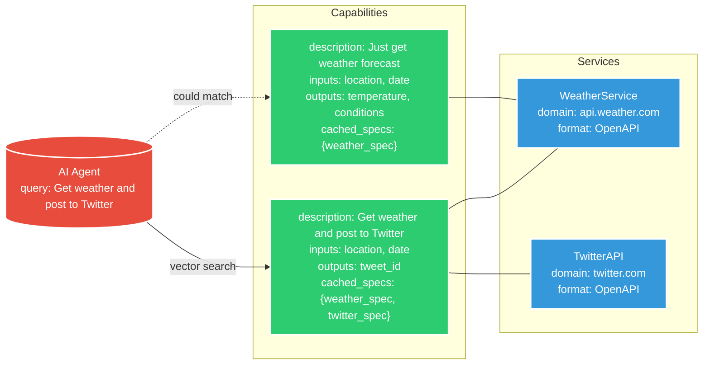
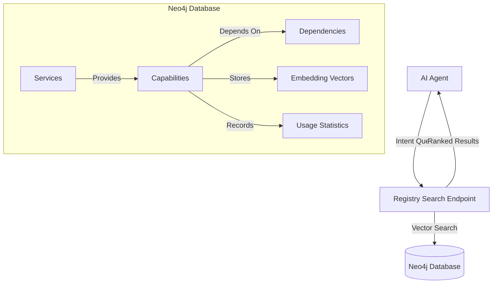

# Agent-to-Service Protocol (A2S)


A2S is a protocol that enables AI agents to discover and execute capabilities at runtime through standardized capability definitions. It allows for discovery at both the service and capability levels, enabling agents to find and execute specific capabilities across multiple services dynamically.


## Introduction

A2S addresses several key challenges that AI agents face when interacting with diverse web services:

1. **Capability Discovery**: How agents find relevant capabilities across services.
2. **Service Integration**: How services expose their capabilities in various formats.
3. **Execution Flow**: How agents coordinate multiple capabilities for complex tasks.
4. **State Management**: Secure handling of state, including variables and data across services.
5. **Security**: Ensuring secure interactions with services, including authentication and data protection.

---

## Key Features

- 🌍 **Language Agnostic**: Implement A2S in any programming language
- 🔍 **Dynamic Service Discovery**: Find and integrate services at runtime
- 🔄 **Communication Protocol Agnostic**: Support for REST through OpenAPI, GraphQL, AsyncAPI, and others.
- 🔐 **Built-in Security**: Standardized authentication and authorization
- 📦 **State Management**: Handle execution state across multiple services


## Example Usage

### Initializing an Agent

```typescript
// User query to agent
const query = "What's the weather like in Paris, and can you tweet it saying 'Weather update:'?";

// Select registry
const defaultRegistry = new A2SRegistry("https://registry.example.com");

// create an agent
const agent = new A2SAgent();
agent.useRegistries([defaultRegistry]);

// handle user's query
agent.handleRequest(query);
```

```typescript
async handleRequest(query: string) {
    // 1. Extract intent and parameters
    const { intents, parameters } = this.parseQuery(query);

    const args = {
      strategy: "highest_score"
    }; // optional args

    // 2. Find relevant capabilities
    const capabilities = await registry.searchCapabilities(intents, args); 

    if (capabilities.length === 0) {
      console.log('No capabilities found matching your query.');
      return;
    }

    // For each capability
    for (const capability of capabilities) {
      // 3. Verify capability integrity
      if (!this.verifyChecksum(capability)) {
        console.error('Capability checksum verification failed.');
        continue;
      }

      // 4. Resolve state. (E.g. provide any needed parameters for a request.)
      const stateStore = new StateStore();
      await this.resolveState(capability, stateStore);

      // 5. Execute capability
      const executor = new CapabilityExecutor(stateStore);
      const response = await executor.executeCapability(capability);

      // 6. Process response
      const finalResponse = this.processResponse(response);

      // 7. Provide feedback
      console.log('Final Response to User:', finalResponse);
    }
}
```

---

## Core Concepts

### Dynamic Protocol Support

A2S is designed to be flexible and communication-protocol-agnostic. Each **step** within a capability specifies the format of its interaction, which can be:

- **OpenAPI**: For RESTful APIs.

In the future it could also potentially support:
- **GraphQL**: For flexible queries and mutations.
- **AsyncAPI**: For event-driven architectures.
- **Custom**: For any other interaction patterns or proprietary communication protocols.

This dynamic support allows agents to interact with a wide range of services seamlessly, even within a single capability execution.

### Capability Header

Each capability definition begins with a header containing essential metadata:

```yaml
a2s: "<protocol_version>"
name: "<capability_name>"
description: "<capability_description>"
charset: "utf-8"
domains:
  - "<domain1>"
  - "<domain2>"
version: "<capability_version>"
checksum: "<checksum_value>"
author: "<list_of_authors>"
```

- **`a2s`**: Specifies the A2S protocol version the capability adheres to.
- **`name`**: A unique identifier for the capability.
- **`description`**: A concise, human-readable explanation of what the capability does.
- **`domains`**: A list of domains that the capability interacts with.
- **`version`**: The version of the capability itself.
- **`checksum`**: A cryptographic hash (e.g., SHA-256) of the capability definition, excluding the `checksum` field itself.
- **`authors`**: credits to the creators and contributors

### Execution Section

We include an `execution` section directly in the capability definition. This section contains all the necessary details for executing the capability.

#### Execution Steps with Individual Formats

Each step in the execution can have its own `format`, allowing for interactions with different services or protocols. When the `format` is `OpenAPI`, the `definition` field should contain a valid OpenAPI specification that includes only the specific path and operation relevant to the step. This eliminates ambiguity about which endpoint will be executed and ensures clarity.

### Step Format

```yaml
steps:
  - id: "<step_id>"
    type: "<step_type>"     # Required: "capability", "sequence", "parallel", "condition"
    format: "<format>"      # Required for direct execution steps
    definition: {}          # Required for direct execution steps
    input_mapping: {}       # Optional
    output_mapping: {}      # Optional
```

By focusing on **capabilities** and supporting **dynamic protocol specifications**, A2S simplifies the way agents discover and execute tasks, allowing for efficient and secure interactions with services.

---


## Architecture



## Creating Capabilities

### Capability Definition

Each capability includes implementation details and provider-specific information. Since the capability is the entire document, we include an `execution` section directly.

#### Execution Steps with OpenAPI Format

Let's illustrate how to define a step using the OpenAPI specification, including only the specific path necessary for the capability.

#### Example Capability Definition with OpenAPI Step

```yaml
a2s: "1.0.0"
name: "ListDogBreeds"
description: "Retrieve a list of dog breeds"
charset: "utf-8"
domains:
  - "dogapi.dog"
version: "1.0"
checksum: "<calculated_checksum>"
authors:
  - name: "Jane Smith"
execution:
  type: sequence
  steps:
    - id: "listBreeds"
      format: "OpenAPI"
      definition:
        openapi: "3.0.1"
        info:
          title: "Dog API - List Breeds"
          version: "1.0.0"
          description: "Retrieve a list of dog breeds from the Dog API."
        servers:
          - url: "https://dogapi.dog/api/v2"
        paths:
          /breeds:
            get:
              summary: "List Breeds"
              tags:
                - "Breeds"
              responses:
                '200':
                  description: "Successful response"
                  content:
                    application/json:
                      schema:
                        type: object
                        properties:
                          data:
                            type: array
                            items:
                              type: object
                              properties:
                                id:
                                  type: string
                                type:
                                  type: string
                                attributes:
                                  type: object
                                  properties:
                                    name:
                                      type: string
                                    description:
                                      type: string
                                    hypoallergenic:
                                      type: boolean
                          links:
                            type: object
                            properties:
                              self:
                                type: string
                              current:
                                type: string
                              next:
                                type: string
                              last:
                                type: string
      input_template: {}  # No inputs required for this endpoint
      output_mapping:
        breeds: "$.data"
```

**Explanation:**

- **Step Definition:**
  - **`format`**: `"OpenAPI"` indicates that this step uses the OpenAPI specification.
  - **`definition`**: Contains a minimal OpenAPI specification focused only on the `/breeds` endpoint that will be executed.
    - **`openapi`**: Version of the OpenAPI specification used.
    - **`info`**: Provides metadata about the API.
    - **`servers`**: Specifies the base URL for API requests.
    - **`paths`**: Includes only the `/breeds` path with the `get` operation.
- **`input_template`**: Empty since no inputs are required for this endpoint.
- **`output_mapping`**: Maps the response data to the `breeds` variable.

### Including Only the Necessary Path

By limiting the OpenAPI specification to only the relevant path and operation, we ensure:

- **Clarity**: The agent knows exactly which endpoint to call without ambiguity.
- **Usability**: The execution follows existing well supported formats.
- **Portability**: The step can easily be shared with other cababilities.


---

### Incorporating Multiple Steps with Different Formats

Now, let's update the previous example of the `PostWeatherTweet` capability to reflect this approach.

#### Updated `PostWeatherTweet` Capability Definition

```yaml
a2s: "1.0.0"
name: "PostWeatherTweet"
description: "Gets weather for a location and posts it to Twitter"
charset: "utf-8"
domains:
  - "api.weather.com"
  - "api.twitter.com"
version: "1.0"
checksum: "<calculated_checksum>"
authors:
  - name: "Alex Johnson"
patterns:
  parameters:
    - name: "location"
      patterns: ["in *", "for *", "at *"]
    - name: "message"
      patterns: ["say *", "tweet *", "post *"]

execution:
  type: sequence
  steps:
    - id: "getWeather"
      format: "OpenAPI"
      definition:
        openapi: "3.0.1"
        info:
          title: "Weather API - Get Current Weather"
          version: "1.0.0"
          description: "Retrieve the current weather for a specific city."
        servers:
          - url: "https://api.weather.com"
        paths:
          /current/{city}:
            get:
              summary: "Get Current Weather"
              parameters:
                - name: "city"
                  in: "path"
                  required: true
                  schema:
                    type: "string"
              responses:
                '200':
                  description: "Successful response"
                  content:
                    application/json:
                      schema:
                        type: object
                        properties:
                          weather:
                            type: object
                            properties:
                              description:
                                type: "string"
      input_template:
        pathParameters:
          city: "${location}"
      output_mapping:
        WEATHER_TEXT: "$.weather.description"

    - id: "postTweet"
      format: "GraphQL"
      definition:
        endpoint: "https://api.twitter.com/graphql"
        query: |
          mutation postTweet($text: String!) {
            createTweet(text: $text) {
              id
              text
            }
          }
      input_template:
        variables:
          text: "${message} ${WEATHER_TEXT}"
      output_mapping:
        tweet_id: "$.data.createTweet.id"
```

**Explanation:**

- **Step `getWeather`:**
  - **`format`**: `"OpenAPI"`
  - **`definition`**: Minimal OpenAPI specification for the `/current/{city}` endpoint.
  - **`input_template`**: Injects the `${location}` variable into the `city` path parameter.
  - **`output_mapping`**: Extracts `weather.description` into `WEATHER_TEXT`.

- **Step `postTweet`:**
  - **`format`**: `"GraphQL"`
  - **`definition`**: Contains the GraphQL mutation for posting a tweet.
  - **`input_template`**: Constructs the `text` variable using `${message}` and `${WEATHER_TEXT}`.
  - **`output_mapping`**: Extracts the `tweet_id` from the response.

---

## Capability Chaining

Capabilities can depend on other capabilities, allowing for complex workflows. Below is an example of a capability that chains multiple dependent capabilities.

### `WeatherAlertCapability` Definition

```yaml
a2s: "1.0.0"
name: "WeatherAlertCapability"
description: "Monitors weather and sends alerts through multiple channels when severe conditions are detected"
charset: "utf-8"
domains:
  - "api.weather.com"
  - "api.twitter.com"
  - "api.telegram.org"
version: "1.0"
checksum: "<calculated_checksum>"
authors:
  - name: "Jane Smith"
    email: "jane.smith@example.com"
    organization: "Weather Systems Inc."
    github: "janesmith2"

dependencies:
  - capability: "GetWeatherAlert"
    version: "^1.0.0"
    checksum: "<dependency_checksum>"
  - capability: "PostSocialUpdate"
    version: "^2.0.0"
    checksum: "<dependency_checksum>"
  - capability: "SendTelegramMessage"
    version: "^1.2.0"
    checksum: "<dependency_checksum>"

execution:
  type: sequence
  variables:
    shared:
      location: "string"
      alert_severity: "string"
      alert_message: "string"
      notification_ids: "object"
  steps:
    - id: "checkWeather"
      type: "capability"
      use: "GetWeatherAlert"
      input_mapping:
        location: "${location}"
        check_severity: true
      output_mapping:
        alert_severity: "$.severity"
        alert_message: "$.description"
        alert_time: "$.timestamp"

    - id: "evaluateAlert"
      type: "condition"
      condition: "${alert_severity} in ['severe', 'extreme']"
      if_true:
        steps:
          - id: "sendAlerts"
            type: "parallel"
            steps:
              - id: "tweetAlert"
                type: "capability"
                use: "PostSocialUpdate"
                input_mapping:
                  platform: "twitter"
                  message: "WEATHER ALERT for ${location}: ${alert_message}"
                output_mapping:
                  notification_ids.twitter: "$.post_id"

              - id: "telegramAlert"
                type: "capability"
                use: "SendTelegramMessage"
                input_mapping:
                  chat_id: "${TELEGRAM_CHAT_ID}"
                  message: "🚨 ${alert_severity} ALERT 🚨\nLocation: ${location}\n${alert_message}\nTime: ${alert_time}"
                output_mapping:
                  notification_ids.telegram: "$.message_id"

output:
  alert_info:
    severity: "${alert_severity}"
    message: "${alert_message}"
    time: "${alert_time}"
  notifications: "${notification_ids}"
```

**Explanation:**

- **Dependencies**: Specifies other capabilities this one depends on.
- **Execution Steps**:
  - **`checkWeather`**: Uses the `GetWeatherAlert` capability.
  - **`evaluateAlert`**: Conditional execution based on `alert_severity`.
    - **If True**: Executes `tweetAlert` and `telegramAlert` in parallel.
- **Output**: Defines the outputs of the capability.
- **Requirements**: Specifies input and output requirements for dependent capabilities.

---


## Registry Architecture

The A2S Registry serves as a central hub for capability discovery, enabling agents to find and utilize relevant capabilities based on their intent. The registry uses a combination of graph database (Neo4j) and vector search to efficiently match agent intents with available capabilities.

### Registry Architecture Overview



### Capability Discovery Process

1. **Intent Submission**
   - Agents submit their intended action to the registry's search endpoint
   - The intent is converted into a vector embedding for semantic matching

2. **Vector Search**
   - The registry performs a vector similarity search against capability descriptions
   - Search happens within Neo4j, utilizing its vector search capabilities
   - Results are ranked by semantic similarity to the original intent

3. **Graph-Enhanced Results**
   - Results can be enriched using graph relationships
   - Dependencies and related capabilities are easily accessible
   - Service metadata can influence ranking

4. **Selection Strategy**
   The default strategy ranks capabilities based on:
   - Vector distance from the intent (primary factor)
   - Historical success rate
   - Usage statistics
   - Capability complexity (number of steps)
   - Required permissions

### Example Search Response

```json
{
  "capabilities": [
    {
      "id": "weather-alert-capability",
      "score": 0.92,
      "description": "Monitors weather and sends alerts through multiple channels",
      "usage_count": 1250,
      "success_rate": 0.98,
      "complexity": "medium",
      "required_permissions": ["weather:read", "notifications:write"]
    },
    // Additional matching capabilities...
  ],
  "metadata": {
    "total_matches": 5,
    "search_time_ms": 45
  }
}
```

### Registry Features

- **Real-time Updates**: Services can dynamically register and update their capabilities
- **Dependency Tracking**: Graph structure makes it easy to track and validate capability dependencies
- **Usage Analytics**: Stores execution statistics to inform future capability selection
- **Vector Indexing**: Optimized for fast semantic search across large capability sets
- **Fallback Strategies**: Supports multiple selection strategies when primary matches fail

### Custom Selection Strategies

Agents can provide custom selection strategies by specifying weights for different factors:

```typescript
interface SelectionStrategy {
  vectorSimilarity: number;  // 0-1 weight for semantic matching
  successRate: number;       // 0-1 weight for historical success
  usageCount: number;        // 0-1 weight for popularity
  complexity: number;        // 0-1 weight for step complexity
  // Additional weighted factors...
}
```

### Future Enhancements

- Capability composition suggestions based on historical patterns
- Dynamic reranking based on real-time service health
- Automated capability testing and validation
- Enhanced analytics for capability usage patterns

## Coming Soon:

### Future sdk implementations:

```python
# Python implementation
from a2s import A2SRegistry, A2SAgent

registry = A2SRegistry("https://registry.example.com")
agent = A2SAgent()
```

```typescript
// TypeScript implementation
import { A2SRegistry, A2SAgent } from '@a2s/core';

const registry = new A2SRegistry("https://registry.example.com");
const agent = new A2SAgent();
```

```go
// Go implementation
import "github.com/a2s/core"

registry := a2s.NewRegistry("https://registry.example.com")
agent := a2s.NewAgent()
```


---

## License

This project is licensed under the [MIT License](LICENSE).