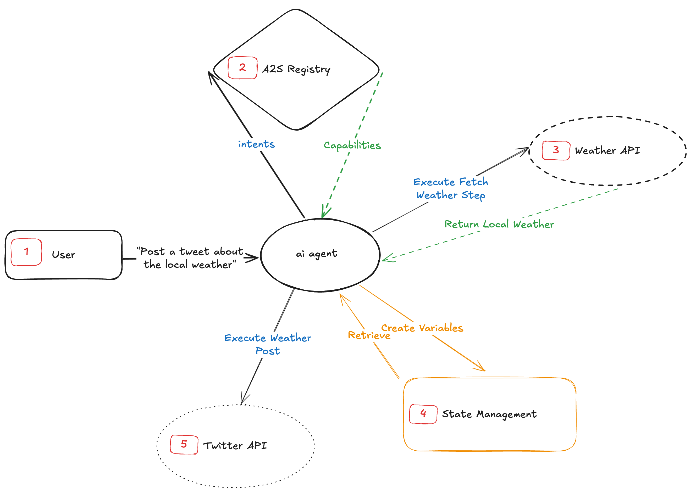

# Agent-to-Service Protocol (A2S)

  [](https://discord.gg/mMfxvMtHyS)

The **Agent-to-Service Protocol (A2S)** enables AI agents to dynamically discover and execute service capabilities at runtime. A2S defines how agents find various capabilities and securely interact with them, making it a powerful framework for integrating AI with APIs.

## Overview

**Why A2S?** Create AI agents that can dynamically discover and execute new capabilities at runtime, extending beyond their initial programming.

## Example

Here's how A2S works in a chat-based interaction:

```
┌──────────────────── A2S Chat Session ────────────────────┐

👤 [USER] > Check the weather for my picnic in Central Park and tweet it.

🤖 [AGENT] > Found capability: PostWeatherTweet
            └─ Services: WeatherAPI.com, Twitter API

   [AGENT] > Task breakdown:
            ├─ 1. Get weather forecast
            └─ 2. Post weather update

   [AGENT] > Would you like a specific message with the weather?

👤 [USER] > Yes, mention it's for a weekend picnic.

🤖 [AGENT] > Tweet posted: "Weekend picnic weather update for Central Park: 
            Sunny with light clouds, high of 75°F. Perfect picnic weather! 🧺☀️"
└───────────────────────────────────────────────────────────┘
```

## Core Features

- **Agent-First Design**: Purpose-built for AI agents to understand and orchestrate API services.
- **Dynamic Discovery**: Runtime service and capability discovery without pre-programming.
- **Atomic Operations**: One request per API operation for clarity and reliability.
- **Secure State Management**: Data handling with storage types and lifecycles.
- **Flow Control**: Support for conditional execution and agent decision-making.
- **Security & Auditing**: Built-in audit trail and permission management.
- **Capability Composition**: Support for atomic and aggregate capabilities.

## Core Concepts

### Capabilities

Each capability is specified in YAML or JSON format with mandatory metadata:

```yaml
a2s: 1.0.0               # Protocol version (required)
id: "WeatherCapability"  # Unique identifier
description: "Fetches weather data and evaluates its impact on user activities"
version: 1.0.0           # Capability version
authors:
  - name: "Author Name"
type: "aggregate"        # aggregate | atomic
checksum: "<sha256>"     # SHA-256 hash

audit:
  status: "audited"      # audited | unaudited | in-progress
  provider: "SecurityFirm Inc."
  id: "AUDIT-2024-001"
  url: "https://security.example.com/audits/AUDIT-2024-001"

permissions:
  level: "elevated"      # basic | elevated | admin
  description: "Required permissions description"
  capabilities:
    - "capability_name"
```

### Capability Types and Composition

A2S supports two types of capabilities:

1. **Atomic Capabilities**
   - Self-contained with no external dependencies.
   - Cannot import other capabilities.
   - Building blocks for larger functionalities.

2. **Aggregate Capabilities**
   - Can import and compose atomic capabilities.
   - Cannot import other aggregate capabilities (prevents circular dependencies).
   - Used for complex workflows and multi-step processes.

### Dependencies and Registries

Capabilities can define their dependencies and registry sources:

```yaml
registries:
  default: "https://registry.a2s.dev"
  custom: "https://custom-registry.company.com"

dependencies:
  weather:
    namespace: "core/weather"
    id: "WeatherCapability"
    version: "^1.0.0"
    checksum: "sha256:abc123..."
    registry: registries.custom

tasks:
  - id: getWeather
    type: capability
    definition:
      - id: getCurrentWeather
        type: capability
        uses: "weather/getWeather"
```

### Tasks

Tasks come in several types:

- `request`: Execute an API operation.
- `agent_decision`: Enable agent decision-making.
- `condition`: Implement conditional branching.
- `sampling`: Request LLM completions.
- `capability`: Execute an imported capability.

### Requests

Requests represent single API operations with:

- One endpoint.
- One HTTP method.
- Defined input/output contract.

Example request specification:

```yaml
getWeatherRequest:
  format: OpenAPI
  specification:
    openapi: 3.0.1
    info:
      title: Weather API
      version: 1.0.0
    servers:
      - url: https://api.weather.com
    paths:
      /weather/{city}:    # Single endpoint
        get: {}           # Single operation
```

### State Management

A2S handles data through storage types and lifecycles:

- **Storage Types**:
  - **Persistent**: Data that persists across multiple sessions or executions.
  - **Transient**: Data that exists only during the execution of the capability.

- **Lifecycles**:
  - **Capability**: Data exists for the duration of the capability's execution.
  - **Session**: Data persists for the user's session.
  - **Execution**: Data exists only for the current execution step.

Example state management definition:

```yaml
state:
  input:
    - services["api.name"].oauth2.client_id
  paramName:
    type: number
    lifecycle: capability
    required: true

  output:
    persistent:
      - services["api.name"].oauth2.access_token
    transient:
      resultData:
        type: object
        schema:
          field: string

  runtime:
    transient:
      tempData:
        type: object
        schema:
          field: number
```

### Services

Services define the external APIs that the capability interacts with:

```yaml
services:
  "api.example.com":
    type: "service-type"
    oauth2:                    # Authentication method
      read:
        - client_id
        - client_secret
      write:
        - access_token
        - refresh_token
    tasks: ["taskName"]        # Associated tasks
```

### Example Task Definition

```yaml
tasks:
  - id: taskName
    type: request
    requires_service: "api.example.com"
    definition:
      request: #/requests/requestName
    input_mapping:
      field:
        type: string
        value: ${reference}
    error_handling:
      on_failure:
        action: "continue"
        message: "Error message"
```

### Flow Control

Define execution flow with sequential, parallel, or conditional steps:

```yaml
flow:
  type: sequence
  steps:
    - task: firstTask
    - type: condition
      if: "${condition}"
      then:
        type: parallel
        tasks: ["task1", "task2"]
      else:
        task: "alternativeTask"
```

### A2S Registry

The A2S Registries enable agents to query and discover new capabilities. The default registry uses a graph database that allows agents to perform semantic searches for relevant capabilities.

Agents can break down user queries into multiple intents and utilize the registry to determine the capabilities that will provide the desired outcome.



## Best Practices

1. **Security First**
   - Always specify audit status.
   - Define minimum required permissions.
   - Use secure state management.

2. **Service Integration**
   - One service per distinct API.
   - Explicit task associations.
   - Clear authentication requirements.

3. **State Management**
   - Minimize persistent state.
   - Use appropriate lifecycles.
   - Clear data schemas.

4. **Error Handling**
   - Define failure actions.
   - Include meaningful messages.
   - Consider fallback options.

5. **Capability Design**
   - Keep atomic capabilities focused and reusable.
   - Use aggregate capabilities for complex workflows.
   - Carefully manage dependency chains.
   - Verify checksums for all dependencies.

## SDK Usage

### TypeScript/JavaScript

```typescript
import { A2SRegistry, A2SAgent } from '@a2s/core';

const registry = new A2SRegistry();
const agent = new A2SAgent();

const capabilities = registry.findCapability("User query");

async function executeCapability(capability) {
  if (!agent.verifyChecksum(capability)) return;
  
  const stateStore = new StateStore();
  await agent.resolveState(capability, stateStore);
  
  const executor = new CapabilityExecutor(stateStore);
  return await executor.execute(capability);
}
```

### Example

```yaml
a2s: 1.0.0
id: WeatherUpdateCapability
description: Gets weather and posts noteworthy updates
version: 1.0.0
authors:
  - name: "Jane Smith"
checksum: "<calculated_checksum>"
type: "aggregate"
source_url: https://github.com/org/repo/weather/analysis.yaml

audit:
  status: "audited"
  provider: "SecurityFirm Inc."
  id: "AUDIT-2024-001"
  url: "https://security.example.com/audits/AUDIT-2024-001"

permissions:
  level: "elevated"
  description: "Requires ability to post on social media and send alerts"
  capabilities:
    - "post_social_media"
    - "send_alerts"

services:
  "api.weather.com":
    type: "weather-api"
    oauth2:
      read:
        - client_id
        - client_secret
      write:
        - access_token
        - refresh_token
    tasks: ["getWeather"]
    
  "api.twitter.com":
    type: "social-media"
    oauth2:
      read:
        - client_id
        - client_secret
      write:
        - access_token
    tasks: ["postSocialMedia"]
    
  "twilio.com":
    type: "messaging"
    apiKey:
      read:
        - key
    tasks: ["sendAlert"]

state:
  input:
    - services["api.weather.com"].oauth2.client_id
    - services["api.weather.com"].oauth2.client_secret
    - services["api.twitter.com"].oauth2.client_id
    - services["api.twitter.com"].oauth2.client_secret
    - services["twilio.com"].apiKey.key
    city:
      type: string
      lifecycle: capability
      required: true

  output:
    persistent:
      - services["api.weather.com"].oauth2.access_token
      - services["api.weather.com"].oauth2.refresh_token
      - services["api.twitter.com"].oauth2.access_token
    transient:
      weatherDetails:
        type: object
        schema:
          location: string
          weather: string

  runtime:
    transient:
      coordinates:
        type: object
        schema:
          long: number
          lat: number

requests:
  getWeatherRequest:
    format: OpenAPI
    specification:
      openapi: 3.0.1
      info:
        title: Weather API
        version: 1.0.0
      servers:
        - url: https://api.weather.com
      paths:
        /weather/{city}:
          get:
            parameters:
              - name: city
                in: path
                required: true
            responses:
              '200':
                content:
                  application/json:
                    schema:
                      type: object
                      properties:
                        temperature:
                          type: number

tasks:
  - id: getWeather
    type: request
    requires_service: "api.weather.com"
    definition:
      request: #/requests/getWeatherRequest
    input_mapping:
      city:
        type: string
        value: ${city}
    output_mapping:
      temperature:
        type: number
        value: $.weather.temperature
    error_handling:
      on_failure:
        action: "continue"
        message: "Weather data fetch failed"

  - id: decideToPost
    type: agent_decision
    description: Evaluate if weather is noteworthy
    output_mapping:
      shouldPost:
        type: boolean
        value: ${decision}

  - id: postSocialMedia
    type: request
    requires_service: "api.twitter.com"
    description: Post to social media

  - id: sendAlert
    type: request
    requires_service: "twilio.com"
    description: Send weather alert

  - id: logDecision
    type: request
    description: Log that no action was taken

flow:
  type: sequence
  steps:
    - task: getWeather
    - task: decideToPost
    - type: condition
      if: "${decideToPost.shouldPost}"
      then:
        type: parallel
        tasks: ["postSocialMedia", "sendAlert"]
      else:
        task: "logDecision"

examples:
  - description: "Post weather alert for high temperature"
    input:
      services:
        "api.weather.com":
          oauth2:
            client_id: "example_id"
            client_secret: "example_secret"
        "api.twitter.com":
          oauth2:
            client_id: "twitter_id"
            client_secret: "twitter_secret"
        "twilio.com":
          apiKey:
            key: "twilio_key"
      city: "San Francisco"
    expected_output:
      weatherDetails:
        location: "San Francisco"
        weather: "32°C, Sunny"
      result: "Posted: High temperature alert for San Francisco. Current temperature: 32°C"

  - description: "Normal weather update without alert"
    input:
      services:
        "api.weather.com":
          oauth2:
            client_id: "example_id"
            client_secret: "example_secret"
        "api.twitter.com":
          oauth2:
            client_id: "twitter_id"
            client_secret: "twitter_secret"
      city: "Seattle"
    expected_output:
      weatherDetails:
        location: "Seattle"
        weather: "18°C, Cloudy"
      result: "Weather conditions normal, no alert needed"
```

## License

This project is licensed under the [MIT License](LICENSE).