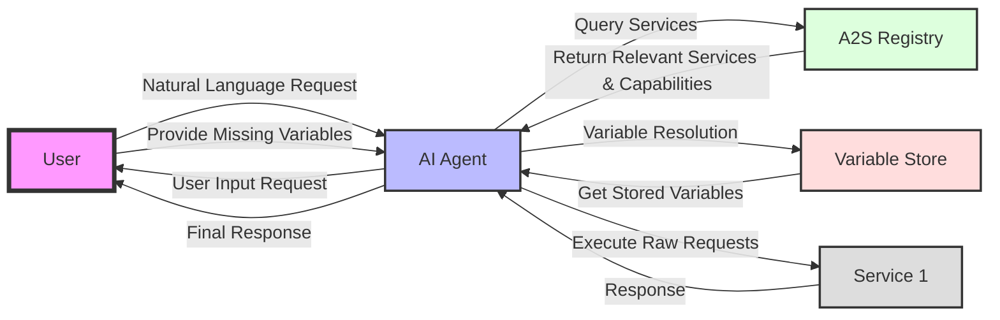
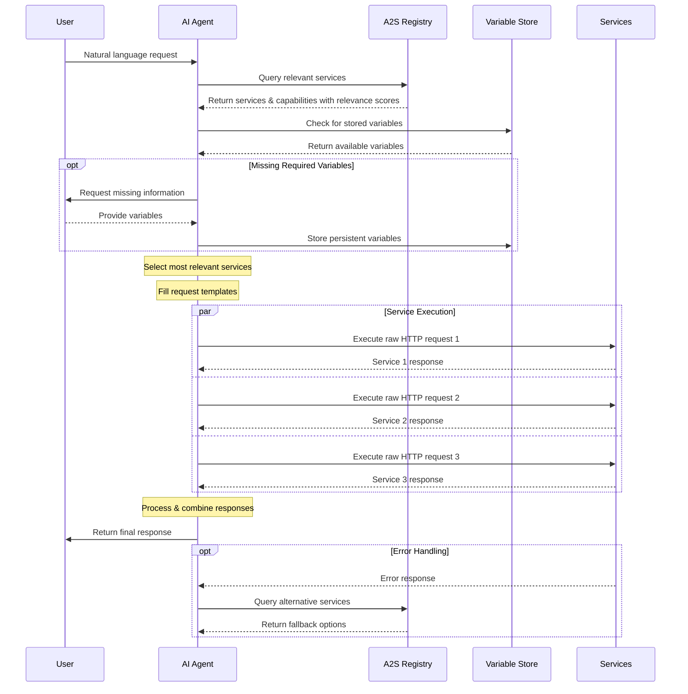

# Agent to Service Protocol (A2S)


A standardized protocol enabling AI agents to discover and execute web service capabilities through natural language understanding and raw HTTP requests. A2S helps agents efficiently coordinate multiple services to solve complex user requests.



## Problem

Currently, AI agents struggle to interact with web services because they must:
- Translate natural language to API calls
- Navigate complex service documentation
- Coordinate multiple services for single tasks
- Handle different authentication methods
- Track user credentials and preferences
- Manage sequential and dependent operations

## Solution

A2S provides a central registry that helps agents:
1. Discover relevant services from natural language requests
2. Access pre-configured HTTP requests
3. Coordinate multi-service operations
4. Manage variables and credentials securely

### Example: Single-Service Flow

User: "What's the weather for this Thursday?"

```yaml
# Registry Response
services:
  - name: "WeatherService"
    description: "Global weather data and forecasts"
    domain: "api.weather.example"
    relevance_score: 0.92
    relevant_capabilities:
      - name: "Forecast Weather"
        description: "Get weather forecast for a specific date"
        relevance_score: 0.95
        requiredVariables: ["API_KEY"]
        tempVariables:
          DATE:
            type: "date"
            description: "Forecast date"
          LAT:
            type: "number"
            description: "Latitude coordinate"
          LON:
            type: "number"
            description: "Longitude coordinate"
        request: |
          GET /v1/forecast HTTP/1.1
          Host: api.weather.example
          Authorization: Bearer ${API_KEY}
          
          ?date=${DATE}&lat=${LAT}&lon=${LON}
```

### Example: Multi-Service Flow

User: "Plan me a weekend trip to Seattle - I need flights, hotel, and want good weather for sightseeing. Budget is $1000."

```yaml
# First Registry Query - Travel Services
services:
  - name: "FlightService"
    description: "Flight booking service"
    relevance_score: 0.94
    relevant_capabilities:
      - name: "Search Flights"
        description: "Find available flights between cities"
        tempVariables:
          FROM:
            type: "airport_code"
          TO:
            type: "airport_code"
          DATE_OUT:
            type: "date"
          MAX_PRICE:
            type: "number"

  - name: "HotelService"
    description: "Hotel booking service"
    relevance_score: 0.92
    relevant_capabilities:
      - name: "Search Hotels"
        description: "Find available hotels in a city"
        tempVariables:
          CITY:
            type: "string"
          CHECK_IN:
            type: "date"
          MAX_RATE:
            type: "number"

# Second Registry Query - Weather & Activities
services:
  - name: "WeatherService"
    description: "Weather forecasts"
    relevant_capabilities:
      - name: "Extended Forecast"
        description: "Multi-day weather forecast"

  - name: "TouristActivities"
    description: "Sightseeing and attractions"
    relevant_capabilities:
      - name: "Search Activities"
        description: "Find weather-appropriate activities"
```




## Protocol Specification

### Service Definition
```yaml
serviceName: "ExampleService"
serviceDescription: "Human-readable description"
domain: "api.example.com"
version: "1.0"
checksum: "3a7bd3e2360a3d5be561819c3df9d6e28d..."  # SHA-256 hash

# Response formats from OpenAPI
responseSchemas:
  success:
    statusCodes: [200, 201]
    format: "application/json"
    schema:
      type: "object"
      required: ["field1"]

# Rate limiting information
rateLimits:
  requestsPerMinute: 60
  burstSize: 10

authentications:
  - type: "oauth2"
    description: "OAuth2 authentication"
    requiredVariables: ["CLIENT_ID"]

capabilities:
  - name: "ExampleCapability"
    description: "Human-readable description"
    requiredScopes: ["scope:permission"]
    tempVariables:
      VAR1:
        type: "string"
        description: "Variable description"
        pattern: "^[A-Za-z]+$"
    request: |
      GET /endpoint HTTP/1.1
      Host: api.example.com
      
      ?param=${VAR1}

# Error handling patterns
errorPatterns:
  - statusCode: 400
    pattern: "Invalid input"
    resolution: "Check input format"
```

### Service Definition
| Field Name         | Type   | Description                                    | Required |
|--------------------|--------|------------------------------------------------|----------|
| serviceName        | string | Name of the service                            | Yes |
| serviceDescription | string | Natural language description for intent matching| Yes |
| domain            | string | Base domain for all requests                    | Yes |
| version           | string | Service definition version                      | Yes |
| checksum           | string | SHA-256 hash of the service                      | Yes |
| responseSchemas    | object | Definition of response formats                 | No |
| rateLimits        | object | Rate limiting configuration                    | No |
| authentications    | array  | Authentication methods                         | No |
| capabilities      | array  | List of service capabilities                   | Yes |
| errorPatterns     | array  | Common error patterns and resolutions          | No |
| security          | object | Security requirements and configurations       | Yes |

### Authentication Object
| Field Name        | Type          | Description                               | Required |
|-------------------|---------------|-------------------------------------------|----------|
| type              | string        | Auth type (oauth2, api_key, etc)          | Yes |
| description       | string        | Human readable description                 | Yes |
| requiredVariables | array[string] | Variables needed for authentication        | Yes |
| request           | string        | Raw HTTP auth request template            | Yes |

### Capability Object
| Field Name        | Type            | Description                               | Required |
|-------------------|-----------------|-------------------------------------------|----------|
| name              | string          | Name of the capability                    | Yes |
| description       | string          | Natural language description              | Yes |
| requiredScopes    | array[string]   | Required authorization scopes             | No |
| requiredVariables | array[string]   | Persistent variables needed               | No |
| tempVariables     | object          | Request-specific variables with validation| No |
| responseSchema    | string          | Reference to response schema              | No |
| request           | string          | Raw HTTP request template                 | Yes |
| examples          | object          | Example requests and responses            | No |

### Variable Definition
| Field Name   | Type    | Description                                  | Required |
|--------------|---------|----------------------------------------------|----------|
| type         | string  | Data type (string, number, date, etc)        | Yes |
| description  | string  | Human readable description                    | Yes |
| pattern      | string  | Regex pattern for validation                 | No |
| min          | number  | Minimum value for numbers                    | No |
| max          | number  | Maximum value for numbers                    | No |
| format       | string  | Format specification (date, email, etc)      | No |
| required     | boolean | Whether variable is required                 | No |
| default      | any     | Default value if not provided               | No |

### Error Pattern Object
| Field Name  | Type    | Description                                  | Required |
|-------------|---------|----------------------------------------------|----------|
| statusCode  | number  | HTTP status code                             | Yes |
| pattern     | string  | Error message pattern                        | Yes |
| resolution  | string  | Human readable resolution steps              | No |
| retry       | boolean | Whether error is retryable                   | No |
| retryAfter  | number  | Seconds to wait before retry                | No |

### Response Schema Object
| Field Name    | Type           | Description                                  | Required |
|---------------|----------------|----------------------------------------------|----------|
| statusCodes   | array[number]  | Valid HTTP status codes                      | Yes |
| format        | string         | Response format (application/json, etc)      | Yes |
| schema        | object         | Response schema definition                   | Yes |
| required      | array[string]  | Required fields in response                  | No |
| examples      | object         | Example responses                           | No |

### Security Object
| Field Name        | Type    | Description                                  | Required |
|-------------------|---------|----------------------------------------------|----------|
| transport         | object  | TLS and certificate requirements             | Yes |
| rateLimits       | object  | Rate limiting configuration                  | No |
| variables        | object  | Variable security requirements               | Yes |
| errorResponses   | object  | Security-related error handling              | No |

## Security Considerations

- HTTPS required with TLS 1.2+
- Domain-scoped variables
- Secure credential storage
- Rate limiting enforcement
- Standardized error handling


The A2S protocol enforces several security requirements to ensure safe communication between agents and services:

- **Transport Security:**
  - All communications must use HTTPS
  - TLS 1.2 or higher is required
  - Valid SSL/TLS certificates from trusted CAs must be used
  - Certificate verification is mandatory

- **Domain Requirements:**
  - All requests in a sequence must be to the same domain specified in the service definition
  - Cross-domain requests are not allowed within a single sequence
  - The Host header in requests must match the service's domain

- **Data Protection:**
  - Sensitive variables (e.g., `${CLIENT_SECRET}`, `${AUTH_TOKEN}`) must be handled securely
  - Tokens should be stored securely and disposed of properly

## Features

1. **Natural Language Understanding**
   - Service matching from user intent
   - Capability relevance scoring
   - Context-aware variable resolution

2. **Multi-Service Coordination**
   - Parallel service discovery
   - Sequential operation handling
   - Budget allocation across services
   - Date and time coordination
   - Dependency management

3. **Security & Reliability**
   - Credential management
   - Rate limiting
   - Error recovery
   - Response validation

## Future Enhancements

1. **Service Discovery**
   - Enhanced relevance scoring
   - Cross-service optimization
   - Fallback service selection
   - Potential use of `/Well-known/a2s` for service discovery

2. **Operation Planning**

3. **Error Recovery**


## Contributing

Areas needing contribution:
- Protocol specification refinements
- Service registry implementations
- Multi-service coordination patterns
- Security model enhancements

## Variable Management

The A2S protocol implements a secure, scoped variable management system that handles different types of variables with appropriate security and access controls.

### Variable Types

#### 1. Service Variables
- Scoped to specific service domains (e.g., `example.com::AUTH_TOKEN`)
- Encrypted at rest using domain-specific keys
- Only accessible by services from matching domains
- Typically used for API keys, tokens, and service-specific credentials
- Persisted across sessions with domain-specific encryption

#### 2. Global Variables
- Available across multiple services (e.g., `global::USER_EMAIL`)
- Requires explicit user trust for service access
- Used for common user information and preferences
- Services must request and receive trust before accessing
- Can be revoked at any time

#### 3. Temporary Variables
- Scoped to single request or operation
- Never persisted to storage
- Cleared after request completion
- Used for request-specific parameters and context

### Variable Store Schema

```yaml
variableStore:
  version: "1.0"
  types:
    serviceVariable:
      format: "${domain}::${name}"
      storage: "encrypted"
      scope: "domain-specific"
      required:
        - domain
        - name
        - value
      encryption:
        type: "AES-GCM"
        keyDerivation: "HKDF"
        domainBinding: true

    globalVariable:
      format: "global::${name}"
      storage: "encrypted"
      scope: "trusted-services"
      required:
        - name
        - value
        - trustList
      trustManagement:
        required: true
        userApproval: true
        revocable: true

    temporaryVariable:
      format: "temp::${name}"
      storage: "memory"
      scope: "request"
      persistence: false
      required:
        - name
        - value
```

### Security Requirements

#### Service Variable Security
- Must be encrypted using domain-specific keys
- Keys must be derived using domain name and user-specific salt
- No cross-domain access allowed
- Must be cleared when service trust is revoked
- Storage must be secured against tampering

#### Global Variable Security
- Services must explicitly request trust
- Trust grants must be user-approved
- Trust status must be persisted securely
- Trust can be revoked at any time
- Access must be logged and auditable

#### Variable Store Security
- Must implement secure encryption at rest
- Must prevent cross-domain access
- Must enforce trust requirements
- Must clear temporary variables after use
- Must protect against replay attacks

### Example Implementation

```typescript
interface VariableStore {
  // Service Variables
  setServiceVariable(domain: string, name: string, value: string): Promise<void>;
  getServiceVariable(domain: string, name: string): Promise<string | null>;
  
  // Global Variables
  setGlobalVariable(name: string, value: string): Promise<void>;
  getGlobalVariable(name: string): Promise<string | null>;
  
  // Trust Management
  trustService(domain: string): Promise<void>;
  revokeTrust(domain: string): Promise<void>;
  isServiceTrusted(domain: string): Promise<boolean>;
  
  // Temporary Variables
  setTempVariable(name: string, value: string): void;
  getTempVariable(name: string): string | null;
}
```

### Service Definition Extensions

Service definitions must specify variable requirements:

```yaml
serviceName: "ExampleService"
domain: "api.example.com"
variables:
  required:
    service:
      - name: "AUTH_TOKEN"
        description: "Authentication token"
        format: "Bearer token"
        encryption: true
    
  optional:
    global:
      - name: "USER_EMAIL"
        description: "User's email address"
        requiresTrust: true
    
    temporary:
      - name: "QUERY"
        description: "Search query"
        format: "string"
```

### Variable Resolution Flow

1. **Service Variable Resolution**
   ```mermaid
   graph TD
       A[Request Starts] --> B{Check Service Variables}
       B -->|Not Found| C[Prompt User]
       B -->|Found| D{Verify Domain}
       C --> E[Encrypt and Store]
       D -->|Match| F[Use Variable]
       D -->|No Match| G[Access Denied]
   ```

2. **Global Variable Resolution**
   ```mermaid
   graph TD
       A[Request Global] --> B{Check Trust}
       B -->|Trusted| C[Return Variable]
       B -->|Not Trusted| D[Request Trust]
       D --> E{User Approves}
       E -->|Yes| F[Grant Access]
       E -->|No| G[Deny Access]
   ```

### Implementation Guidelines

1. **Variable Storage**
   - Use secure storage mechanisms
   - Implement domain-specific encryption
   - Clear temporary variables reliably
   - Protect against unauthorized access

2. **Trust Management**
   - Implement clear trust UI/UX
   - Store trust grants securely
   - Handle trust revocation
   - Audit trust usage

3. **Error Handling**
   - Handle missing variables gracefully
   - Provide clear error messages
   - Implement retry mechanisms
   - Log security violations

### Best Practices

1. **Service Variables**
   - Always use domain-specific encryption
   - Implement secure key derivation
   - Clear on domain mismatch
   - Audit access attempts

2. **Global Variables**
   - Minimize trust grants
   - Clear documentation of usage
   - Regular trust review
   - Secure trust storage

3. **Temporary Variables**
   - Clear after each request
   - No persistent storage
   - Validate all inputs
   - Scope to current request

4. **General Security**
   - Regular security audits
   - Secure key management
   - Access logging
   - Update mechanisms


## License

MIT License